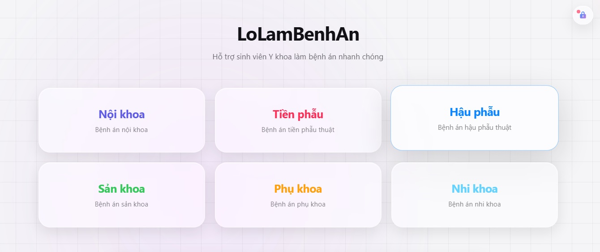

# LoLamBenhAn

LoLamBenhAn là web app hỗ trợ sinh viên Y khoa làm bệnh án nhanh, rõ, đúng cấu trúc và có thể cộng tác theo thời gian thực.

## Mục tiêu dự án

- Giảm thời gian làm bệnh án
- Tăng độ chính xác và tính nhất quán
- Hỗ trợ học lâm sàng theo quy trình rõ ràng
- Kết hợp AI vào học tập và thực hành một cách an toàn, có kiểm soát

## Tính năng chính

- Hệ thống form bệnh án theo từng chuyên khoa (nội, ngoại, sản, nhi, tiền phẫu, hậu phẫu, gây mê hồi sức...)
- Cộng tác nhóm realtime qua WebSocket, giảm xung đột khi nhiều người cùng chỉnh sửa
- Tự động tính chỉ số lâm sàng (ví dụ BMI, Z-score) và hỗ trợ tổng hợp nội dung
- Xem trước và xuất file Word (DOCX) theo mẫu để nộp/in/lưu trữ
- Tích hợp AI hỗ trợ viết và chuẩn hóa nội dung bệnh án

## Tính năng AI mới

- Gọi AI tự động theo luồng lâm sàng:
  1. Chẩn đoán sơ bộ
  2. Đề xuất cận lâm sàng cần làm
  3. Đọc và diễn giải kết quả cận lâm sàng
  4. Chẩn đoán xác định
  5. Đề xuất hướng xử trí

Luồng này giúp người học đi đúng trình tự tư duy lâm sàng, giảm thiếu sót khi lập bệnh án và tăng tốc độ hoàn thiện hồ sơ.

## Công nghệ

- Frontend: HTML, CSS, JavaScript
- Realtime: WebSocket
- Backend: Node.js (ws-server)
- AI: Gemini / Groq
- Export: DOCX

## Demo

- https://lolambenhan.vercel.app/

## Đóng góp

Mọi góp ý đều được hoan nghênh. Bạn có thể tạo Issue hoặc Pull Request để cùng cải thiện dự án.
